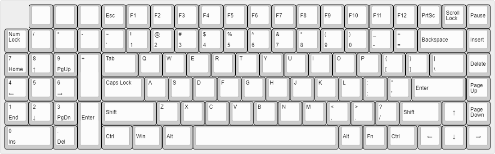
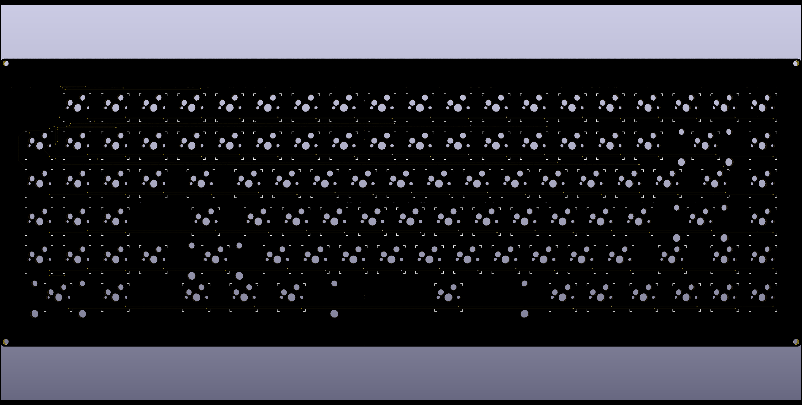

### minato

southpaw extended 75% layout keyboard, kailh MX sockets for hotswap functionality, using the Elite-C.

My first design, and a continuous work-in-progress.

---

- _2/9/2020:_ First revision boards sent for production.
